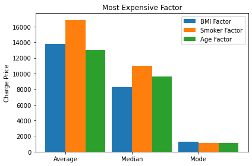

# Michael-Portfolio
Data analysis portfolio

# [Spotify Top Streamd Songs of 2023 Dashboard](https://app.powerbi.com/view?r=eyJrIjoiMmVjN2NjMjctMzAyZC00ZTE1LWE2N2MtY2M2MDZmZmFjYjVmIiwidCI6ImMwZjhjZmRlLWY4YTUtNGFhZi1iODdjLWYyZjFlZWRiMmMzZCIsImMiOjF9)
## An interactive dashboard showcasing the top songs on Spotify in 2023 along with accompanying statistics:
#### Data Enrichment:
* Connect to Spotify Developer and get an API token.
* Load the data using Python, Pandas.
* Create an API function that return the Album Cover by Track_Id.
* Create a function to iterate through the dataset and retrieve Track_ID based on Track_name and Artist_name.
* Use all functions on my dataset and update it.

#### PowerPoint:
* Designd a background for the Dashboard.

#### Power BI:
* Load the dataset into Power BI.
* Establish a Date column and a Date Table, enabling an active relationship between them.
* Generate Measures for visualizations.
* Employ HTML code within the HTML Visual to exhibit Album Cover Pictures with rounded corners.
* Apply Deneb script for advanced visualizations.

### Data Source:
Kaggle

# [Jeopardy-Analysis](https://github.com/Michaelbab7/Jeopardy-Analsis/blob/main/Jeoprdy%20project.ipynb)
## An analysis of  dataset of the game show Jeopardy:
* Loading the dataset via pandas library. 
* Cleaning columns name.
* Created a function that filter the data set by set of words that apear in rows in a certian column.
* Finding the average value of questions that contains the word "King".
* Created a function that counts the unique answers of the dataset
* Compare how many question from the 90's contains the word "Computer" compare to the 00's
* Created a game of Jeopardy, a system that takes 20 random question answers and there value, that take an answer from the user and checks if his right. At the end return the number of right answers and the value earnd.

### Data Source:
Codecademy

# [Sales Analysis](https://github.com/Michaelbab7/Projects/blob/main/Sales%20Analysis.ipynb)
## Set of real world data analyst tasks completed using the Python Pandas library.
#### Cleaning the data:
* Drop NaN values from DataFrame
* Removing rows based on a condition
* Change the type of columns (to_numeric, to_datetime, astype)

####  Explore 5 high level business questions related to our data:
* What was the best month for sales? How much was earned that month?
* What city sold the most product?
* What time should we display advertisemens to maximize the likelihood of customer’s buying product?
* What products are most often sold together?
* What product sold the most? Why do you think it sold the most?

#### In order to answer these questions i used many different pandas & matplotlib methods. They include:
* Concatenating multiple csvs together to create a new DataFrame (pd.concat)
* Adding columns
* Parsing cells as strings to make new columns (.str)
* Using the .apply() method
* Using groupby to perform aggregate analysis
* Plotting bar charts and lines graphs to visualize our results
* Labeling our graphs

### Data Source:
Kaggle

# [US Medical Insurance Costs Analysis](https://github.com/Michaelbab7/Projects/blob/main/us-medical-insurance-costs-project.ipynb)
## Set of real world US medical insurance costs across the country task complete using python and mathplotlib library
#### Load and setting the data so it will be easier to manipulate it.
* Load the data into a dictionary
* Convert every key into a list
* Change the "Sex" and "Smoker" into a binary list, change the "BMI" list into a float, and the "Number of children" into an int.

#### Creating an innit class that contains attributes and functions that ill use more than once.
* Create each list as an attribute.
* Create 3 functions that ill use reputedly, that each will return the average, median or the mode of a factor.

#### Explore 5 question that relate to our data.
* What is the averge, median and mode of the insurance costs?
* What factor affect the most on the price of the insurance cost?
* Will your sex impact on the costs of the insurance?
* What factor affect the most on the price for males? And what factor affect the most for females?
* There is factors that affect the price that not appear in the file?

#### In order to answer these questions i used many different Python & matplotlib methods. They include:
* Using for loops in order to iterate through lists.
* Using if statment to separate between relevant data by condition.
* Plotting bar charts and lines graphs to visualize our results
* Labeling our graphs

### Data Source:
Codecademy
